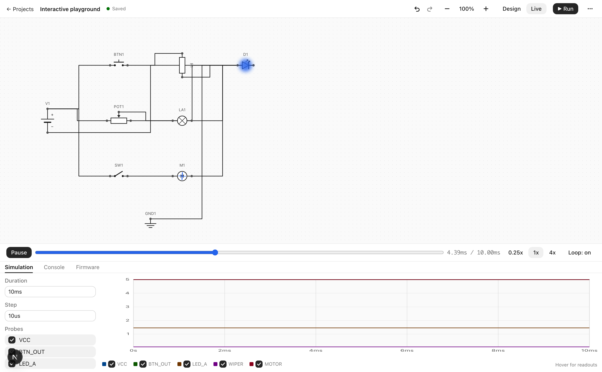
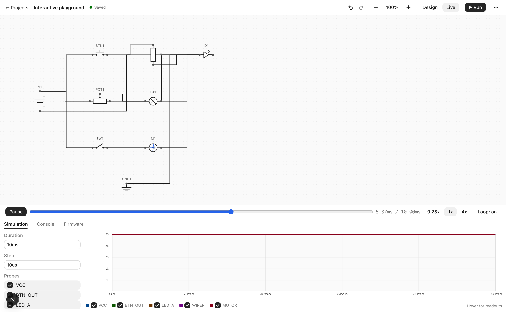
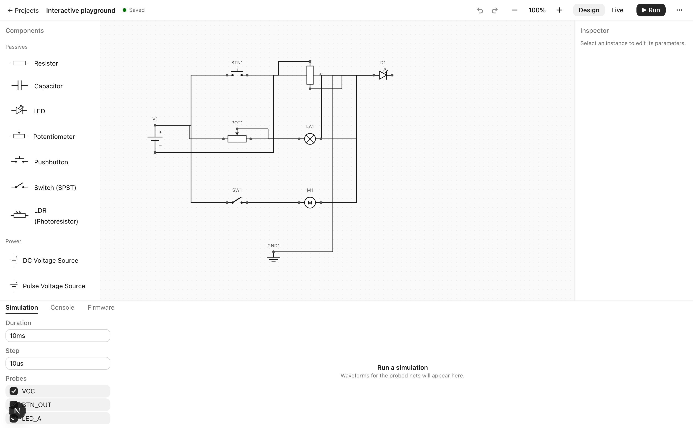
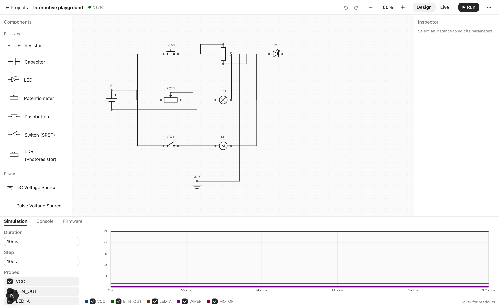
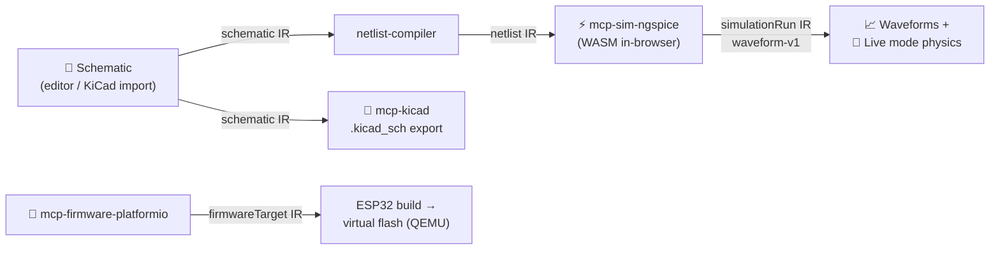

<div align="center">

# ⌬ OpenBench

**The open workbench for electronics.**
Design schematics, simulate circuits with real SPICE, and watch them come alive — LEDs glow, motors spin, buttons click — all in one browser tab.

[](LICENSE)
[](#development)
[](https://openbench-eta.vercel.app)
[](#how-this-repo-builds-itself)
[](CONTRIBUTING.md)

**[▶ Open the bench](https://openbench-eta.vercel.app)** · **[Try the interactive playground](https://openbench-eta.vercel.app/editor/playground)** · **[Interchange format](.context/interchange-format.md)** · **[Architecture](.context/architecture.md)**



*Live mode: press the button, drag the pot, flip the switch — every interaction re-runs real ngspice (WebAssembly) and the circuit reacts.*

</div>

---

## Why OpenBench

Electronics tooling is powerful but fragmented: schematic capture in one desktop app, simulation in another, firmware in a third — with proprietary formats in between. OpenBench orchestrates the best **open engines** behind **one versioned interchange format**, in the browser:

| | Engine | What it does here |
| --- | --- | --- |
| 🎨 | **Schematic editor** (bespoke) | Figma-feel canvas: place parts, draw nets, undo/redo, autosave |
| ⚡ | **[ngspice](https://ngspice.sourceforge.io/)** (WebAssembly) | Real SPICE transient analysis, locally in your tab — no server, no queue |
| 🔀 | **[KiCad](https://www.kicad.org/)** format | Import/export `.kicad_sch` — your designs stay portable |
| 🔧 | **[PlatformIO](https://platformio.org/)** | Firmware builds for ESP32, flash-to-virtual-MCU (QEMU) |
| 🤖 | **[MCP](https://modelcontextprotocol.io)** | Every engine wrapped as an MCP server — AI agents use the same contracts you do |

No account. No install. Everything is Apache-2.0 (patent grant included).

## ✨ Highlights

### Live mode — circuits you can touch


Enter **Live** and the schematic becomes a running device: LED brightness follows the Shockley-modeled current, the motor's rotor spins proportional to voltage, buzzers ripple, lamps glow. Push buttons are momentary, switches latch, potentiometers and photoresistors get drag sliders — each interaction updates the IR document and re-runs the simulation in ~real time. Scrub the timeline like a video.

### A real editor, not a CAD relic


Pan/zoom/snap canvas, marquee selection, pin-to-pin wire drawing that creates and merges IR nets, keyboard-first (Del, R, ⌘Z/⇧⌘Z), parameter inspector, and debounced autosave to your browser. Built on Meta's [Astryx](https://github.com/facebook/astryx) design system.

### Real waveforms from real SPICE


The RC low-pass demo drives a PULSE source through ngspice-WASM and plots genuine exponential charge/discharge — with multi-signal traces, engineering-notation axes, hover readouts, and the full SPICE deck one tab away.

### 17 curated parts and counting
Resistor, capacitor, LED, RGB LED, diode, NPN transistor, potentiometer, pushbutton, switch, DC motor, buzzer, lamp, LDR, DC & PULSE sources, ground, ESP32 DevKit — every part is a validated IR document with a real SPICE model (interactive parts use safe derived-parameter expressions).

## Quick start

**Use it:** open **[openbench-eta.vercel.app](https://openbench-eta.vercel.app)**, pick a template (RC low-pass, ESP32 blink, or the interactive playground), and hit **Live**.

**Run it locally:**

```bash
git clone https://github.com/shuvamk/openbench.git
cd openbench
npm install
npm run dev        # http://localhost:3000
npm test           # 525 tests
```

## How it works

Engines never talk to each other — every hand-off is a JSON document in the [OpenBench IR](.context/interchange-format.md) (versioned, provenance-stamped, zod-validated):



| Package | Role |
| --- | --- |
| [`packages/ir-schema`](packages/ir-schema) | The canonical IR: schemas, validation, versioning |
| [`packages/registry`](packages/registry) | Curated component library (validated IR documents) |
| [`packages/netlist-compiler`](packages/netlist-compiler) | Schematic → SPICE-ready netlist (safe expression evaluator for interactive parts) |
| [`packages/mcp-kicad`](packages/mcp-kicad) | KiCad adapter + MCP server (lossless round-trip via metadata) |
| [`packages/mcp-sim-ngspice`](packages/mcp-sim-ngspice) | ngspice adapter + MCP server (WASM & mock backends) |
| [`packages/mcp-firmware-platformio`](packages/mcp-firmware-platformio) | PlatformIO adapter + MCP server (ESP32, QEMU machine configs) |
| [`apps/web`](apps/web) | The browser app (Next.js + Astryx) |

Engine-by-engine status, capabilities, and documented lossy fields: [`.context/engine-status.md`](.context/engine-status.md).

## How this repo builds itself

OpenBench is built **autonomously by AI agents** coordinating through GitHub issues — a planner decomposes features into test-shaped issues, TDD implementers work them red→green (a pre-tool hook mechanically blocks source edits without a prior failing test), an adversarial reviewer gates every merge, and every merge to `main` deploys to production with an automatic health probe + revert path. Humans are welcome in the exact same pipeline — see [CONTRIBUTING.md](CONTRIBUTING.md).

The repo's "brain" lives in [`.context/`](.context/): current architecture, an append-only decision log (ADRs), the interchange format, engine status, and a deploy log. Read it before contributing — CI enforces that it stays fresh.

## Roadmap

- ✅ **Phase 0** — autonomous agentic pipeline (issues → TDD → review gate → deploy)
- ✅ **Phase 1** — vertical slice: editor → IR → ngspice-WASM → waveforms; KiCad round-trip; PlatformIO adapter; dashboard
- ✅ **Phase 1.5** — Live mode, 17-part library, undo/redo, KiCad UI, MCP servers, interactive playground
- 🔜 Firmware-in-the-loop: ESP32 firmware driving GPIO events into the live circuit (QEMU)
- 🔜 Operating-point & AC analyses; current probes; oscilloscope-style triggers
- 🔜 Community component registry (curator-gated submissions)
- 🗓 **Phase 2** — real-time multiplayer (CRDT), PCB layout, more MCU families

## Development

TypeScript strict everywhere, [vitest](https://vitest.dev), npm workspaces. The TDD contract, label taxonomy, and agent roles are documented in [CLAUDE.md](CLAUDE.md) and [`.context/agent-roles.md`](.context/agent-roles.md).

```bash
npm test                                # full suite
npm run test -w packages/ir-schema      # one package
npm run validate:ir                     # IR spec-sync
```

## License

[Apache-2.0](LICENSE) — the patent grant matters for hardware.
